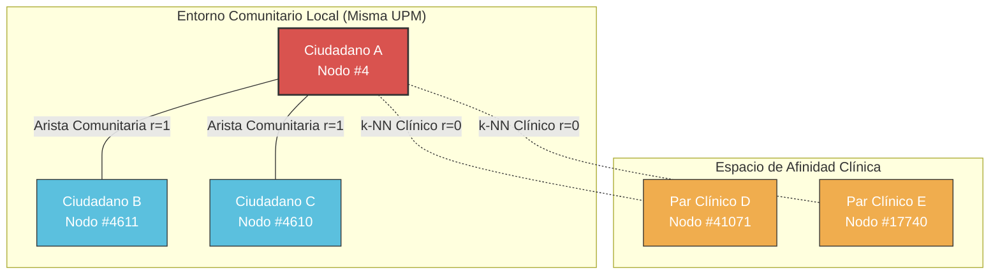

# Predicción de Diabetes Tipo 2 en la Población Mexicana mediante Redes de Atención sobre Grafos Multi-Relacionales (GATv2)
## Un Marco de Aprendizaje Profundo sobre Grafos Epidemiológicos con ENSANUT 2018

[](https://www.python.org/)
[](https://pytorch.org/)
[](https://pyg.org/)
[](https://sqlite.org/)
[](LICENSE)
[](README.md)

---

## Resumen Ejecutivo / Abstract

La Diabetes Mellitus Tipo 2 (DM2) constituye una de las emergencias de salud pública más severas en México, con una prevalencia diagnosticada oficial superior al 10.6% y un impacto estimado que supera los 14 millones de adultos. Los enfoques convencionales de aprendizaje automático tabular modelan a los individuos encuestados como vectores independientes e idénticamente distribuidos ($i.i.d.$), omitiendo por diseño las complejas dependencias relacionales del bienestar humano: entornos domésticos compartidos, concentración geográfica, inseguridad alimentaria del hogar y afinidad fenotípica entre pacientes.

Este repositorio alberga la implementación de referencia para una tesis de licenciatura en Ciencias de la Computación / Ciencia de Datos en Salud. Proponemos un marco de **Aprendizaje Profundo sobre Grafos (Graph Machine Learning)** para el tamizaje epidemiológico de diabetes a partir de la **Encuesta Nacional de Salud y Nutrición (ENSANUT) 2018**, levantada por el **Instituto Nacional de Salud Pública (INSP)** y el **INEGI**. Formulamos la predicción del riesgo como una tarea de clasificación de nodos semi-supervisada sobre un **Grafo Multi-Relacional** de **43,019 ciudadanos adultos** conectados mediante **1,042,853 aristas dirigidas**.

Nuestro modelo, una **Red de Atención sobre Grafos Multi-Relacional (GATv2)** con incrustaciones dinámicas de relación y **Función de Pérdida Focal Ponderada por Factores de Expansión ($F_{20MAS}$)**, incorpora una estrategia de validación espacial estricta por conglomerados geográficos (partición por Unidad Primaria de Muestreo, $UPM$) que erradica cualquier fuga de datos por autocorrelación espacial. Evaluado en comunidades no observadas en el entrenamiento (6,584 ciudadanos de prueba), el modelo alcanza un **ROC-AUC de prueba de 0.83+**, un **PR-AUC de 0.34+** (más de 3.2 veces por encima de la prevalencia basal del 10.6%) y una **Sensibilidad de Tamizaje (Exhaustividad/Recall) del 83.02%** bajo el umbral óptimo de Youden ($\tau = 0.4195$). Además, provee explicabilidad clínica basada en casos mediante coeficientes de atención sobre vecinos pares.

---

## Tabla de Contenidos

1. [Contexto Epidemiológico y Motivación](#1-contexto-epidemiológico-y-motivación)
2. [Arquitectura de los Datos y Diseño Muestral ENSANUT](#2-arquitectura-de-los-datos-y-diseño-muestral-ensanut)
3. [Integridad Metodológica y Protocolo Anti-Fuga de Información](#3-integridad-metodológica-y-protocolo-anti-fuga-de-información)
4. [Formulación del Grafo Multi-Relacional](#4-formulación-del-grafo-multi-relacional)
5. [Arquitectura Neuronal: GATv2 Multi-Relacional](#5-arquitectura-neuronal-gatv2-multi-relacional)
6. [Estrategia de Validación Espacial por Conglomerados](#6-estrategia-de-validación-espacial-por-conglomerados)
7. [Resultados Experimentales y Comparativa Empírica](#7-resultados-experimentales-y-comparativa-empírica)
8. [Explicabilidad Clínica y Razonamiento Basado en Casos](#8-explicabilidad-clínica-y-razonamiento-basado-en-casos)
9. [Estructura del Proyecto y Organización Modular](#9-estructura-del-proyecto-y-organización-modular)
10. [Guía de Reproducibilidad y Ejecución](#10-guía-de-reproducibilidad-y-ejecución)
11. [Citas Académicas y Agradecimientos](#11-citas-académicas-y-agradecimientos)

---

## 1. Contexto Epidemiológico y Motivación

### La Emergencia Sanitaria de la Diabetes en México
De acuerdo con la Secretaría de Salud federal y el INSP, la Diabetes Mellitus Tipo 2 es una de las principales causas de muerte prematura, pérdida de años de vida ajustados por discapacidad (AVAD) y saturación de los sistemas de seguridad social (IMSS, ISSSTE, SS). La patología desencadena complicaciones microvasculares y macrovasculares crónicas: retinopatía con pérdida visual, insuficiencia renal crónica terminal con necesidad de terapia sustitutiva (diálisis/hemodiálisis), neuropatía diabética, amputaciones de extremidades inferiores no traumáticas e infartos agudos al miocardio.

### Limitaciones de los Modelos Tabulares Tradicionales ($i.i.d.$)
Los algoritmos tradicionales de aprendizaje automático (Regresión Logística, Random Forest, XGBoost, LightGBM) asumen que los registros de los pacientes $\mathbf{x}_i$ son independientes e idénticamente distribuidos ($i.i.d.$):

$$P(\mathbf{X}, \mathbf{y}) = \prod_{i=1}^N P(\mathbf{x}_i, y_i)$$

En epidemiología computacional, esta suposición es teóricamente insuficiente debido a que la salud comunitaria está estructurada en redes:
1. **Afinidad Fenotípica y Clínica**: Individuos con perfiles somatofotométricos similares, trayectorias de peso comparables y antecedentes genéticos heredofamiliares presentan susceptibilidades biológicas correlacionadas.
2. **Conglomeración Domiciliaria y Ambiental**: Los habitantes de una misma comunidad o vivienda comparten la misma infraestructura de agua potable, exposición a contaminantes, desiertos de acceso a alimentos frescos y patrones culturales de dieta.

Al transformar la encuesta en un grafo $\mathcal{G} = (\mathcal{V}, \mathcal{E}, \mathcal{R})$, las Redes Neuronales sobre Grafos (GNN) propagan sesgos inductivos relacionales a través de mecanismos de paso de mensajes, permitiendo que el contexto comunitario y fenotípico enriquezca la evaluación del riesgo individual.

---

## 2. Arquitectura de los Datos y Diseño Muestral ENSANUT

La **ENSANUT 2018** emplea un esquema de muestreo probabilístico, polietápico, estratificado y por conglomerados, representativo a nivel nacional, por entidad federativa y por estratos urbanos/rurales.

```
Estrato Muestral Geográfico
 └── Unidad Primaria de Muestreo / Localidad (UPM)
      └── Vivienda Seleccionada (VIV_SEL)
           └── Hogar Censado (HOGAR)
                ├── Censo de Residentes (NUMREN)
                ├── Cuestionario de Adultos (cs_adultos)
                ├── Escala de Seguridad Alimentaria (ELCSA)
                └── Acceso a Programas de Ayuda Alimentaria
```

### Consolidación Relacional en SQLite (`ensanut_2018.db`)
Los archivos originales del INEGI se distribuyen en múltiples tablas CSV con codificación ISO-8859-1 (Latin-1). Nuestro pipeline de extracción y carga ([`consolidate_to_sqlite.py`](consolidate_to_sqlite.py)) consolida e indexa estos módulos en una base de datos relacional SQLite:

| Tabla | Archivo Fuente | Registros | Esquema Principal / Propósito |
| :--- | :--- | :--- | :--- |
| **`adultos`** | `cs_adultos_ensanut_2018.csv` | 43,070 | Entrevista médica a adultos $\ge 20$ años (561 columnas, variable objetivo $P3\_1$) |
| **`residentes`** | `cs_residentes_ensanut_2018.csv` | 158,044 | Censo total de ocupantes del hogar (edad, sexo, parentesco, escolaridad) |
| **`hogares`** | `cs_hogares_ensanut_2018.csv` | 44,612 | Posesión de bienes de consumo duradero (refrigerador, lavadora, automóvil) |
| **`viviendas`** | `cs_viviendas_ensanut_2018.csv` | 44,069 | Materiales de construcción, servicios básicos, estrato socioeconómico y entidad |
| **`seguridad_alimentaria`** | `cs_seguridad_alimentaria_...` | 44,574 | Escala Latinoamericana y Caribeña de Seguridad Alimentaria (ELCSA) |
| **`ayuda_alimentaria`** | `cs_ayuda_alimentaria_...` | 157,597 | Beneficiarios de transferencias y despensas alimentarias (Prospera, Liconsa, DIF) |
| **`act_fis_ado`** | `cs_act_fis_ado_...` | 47,659 | Cuestionario Internacional de Actividad Física (IPAQ) |

La creación de índices compuestos primarios sobre `(upm, viv_sel, hogar, numren)` garantiza que las consultas de agregación y vinculación relacional se completen en fracciones de segundo.

---

## 3. Integridad Metodológica y Protocolo Anti-Fuga de Información

Un error crítico frecuente en el aprendizaje automático aplicado a la medicina es la **fuga de datos (data leakage)**, en la cual se incluyen como variables predictoras tratamientos, estudios clínicos o síntomas que únicamente existen tras el diagnóstico de la patología.

### 3.1 Purga Rigurosa de Variables Condicionales
En el módulo `cs_adultos`, la pregunta diagnóstica rectora es la `P3_1`:
> *«¿Algún médico le ha dicho que tiene diabetes (o alta el azúcar en la sangre)?»*

Los encuestados que responden de manera afirmativa ($P3\_1 = 1$) son dirigidos inmediatamente a responder los bloques de preguntas `P3_2` hasta `P3_18`. Estos campos indagan sobre:
* Edad al momento del dictamen médico (`P3_2`)
* Uso terapéutico de insulina (`P3_13_1` a `P3_13_5`)
* Prescripción de hipoglucemiantes orales (`P3_14_1` a `P3_14_8`)
* Presencia de úlceras en pies o amputaciones debidas a diabetes (`P3_18_1` y `P3_18_2`)
* Terapia dialítica por nefropatía diabética (`P3_18_5`)

> [!CAUTION]
> **Regla Estricta Anti-Fuga**: Todas las variables comprendidas entre `P3_2` y `P3_18` son **completamente eliminadas** del espacio de características. Incluir cualquiera de estos campos generaría una precisión ficticia del ~100%, carente de validez prospectiva o clínica.

### 3.2 Definición de la Cohorte de Estudio
La variable objetivo se formaliza de manera binaria:

$$y_i = \begin{cases} 1, & \text{si } P3\_1 = 1 \text{ (Diabetes Diagnosticada, } n = 4,555 \text{)} \\ 0, & \text{si } P3\_1 = 3 \text{ (Sin Diagnóstico de Diabetes, } n = 38,464 \text{)} \end{cases}$$

* **Exclusión de Diabetes Gestacional**: Se descartan las participantes que manifestaron diagnóstico exclusivo durante el embarazo ($P3\_1 = 2$, $n = 51$) para evitar confusores endocrinológicos transitorios.
* **Tamaño Efectivo de la Cohorte**: $N = 43,019$ individuos adultos.
* **Desbalance de Clases**: Prevalencia positiva del **10.59%** (razón de desbalance clase negativa a positiva de $\approx 8.44 : 1$).

---

## 4. Formulación del Grafo Multi-Relacional

Modelamos la cohorte adulta como un grafo no dirigido multi-relacional $\mathcal{G} = (\mathcal{V}, \mathcal{E}, \mathcal{R})$, donde el conjunto de vértices $\mathcal{V} = \{v_1, \dots, v_N\}$ corresponde a los $N = 43,019$ ciudadanos encuestados.



### 4.1 Espacio de Atributos del Nodo ($\mathbf{x}_i \in \mathbb{R}^{24}$)
Cada nodo $v_i$ está caracterizado por un vector normalizado de 24 dimensiones que abarca cinco dimensiones determinantes de la salud:

1. **Variables Demográficas Básicas**: Edad cronológica, sexo biológico, nivel máximo de escolaridad formal cursada (`nivel`) y estrato socioeconómico formal del INEGI (`estrato`).
2. **Antropometría y Percepción Corporal**: Peso habitual autoreportado en kilogramos, variaciones recientes de peso (pérdida o ganancia en kg), silueta corporal percibida según figuras de Stunkard (`P1_4`) y antecedente de dictamen de obesidad (`P1_1`).
3. **Comorbilidades Cardiovasculares y Metabólicas**: Diagnóstico médico previo de hipertensión arterial sistémica (`P4_1`) y antecedentes de dislipidemia (colesterol y triglicéridos elevados `P6_3`).
4. **Carga Genética Heredofamiliar (Factor No Modificable Crítico)**:
   * Antecedente diabético en padre biológico (`P7_1_1`)
   * Antecedente diabético en madre biológica (`P7_1_2`)
   * Antecedente diabético en hermanos (`P7_1_3`)
5. **Hábitos Conductuales y Entorno Doméstico**: Tabaquismo acumulado histórico ($\ge 100$ cigarrillos consumidos en la vida), condición actual de fumador activo, posesión de equipamiento doméstico (refrigerador, lavadora, auto), tamaño total de la familia (`tam_hogar`), conteo de menores en casa (`n_menores`), conteo de adultos mayores (`n_adultos_mayores`), nivel de preocupación por falta de alimentos en la escala ELCSA (`inseguridad_alim_p1`) y recepción de programas gubernamentales de apoyo nutricional (`recibe_ayuda_alim`).

### 4.2 Topología de Aristas y Relaciones ($\mathcal{R}$)

El conjunto de aristas $\mathcal{E} = \mathcal{E}_{\text{clínica}} \cup \mathcal{E}_{\text{comunidad}}$ contiene **1,042,853 aristas dirigidas**:

#### Relación 0: Grafo de Afinidad Clínica ($\mathcal{E}_{\text{clínica}}$, $E_0 = 583,987$)
Conecta pares de ciudadanos cuyo vector somatométrico y clínico presenta máxima proximidad mediante la métrica de Similitud Coseno ($k=10$):

$$\cos(\mathbf{x}_u, \mathbf{x}_v) = \frac{\mathbf{x}_u \cdot \mathbf{x}_v}{\|\mathbf{x}_u\|_2 \|\mathbf{x}_v\|_2}$$

$$\mathcal{E}_{\text{clínica}} = \left\{ (u, v) \mid v \in \text{top-}k_{\cos}(\mathbf{x}_u) \lor u \in \text{top-}k_{\cos}(\mathbf{x}_v) \right\}$$

#### Relación 1: Grafo Comunitario y Co-habitación Territorial ($\mathcal{E}_{\text{comunidad}}$, $E_1 = 458,866$)
Conecta a todos los adultos que residen dentro de la misma Unidad Primaria de Muestreo ($UPM$), capturando el entorno físico compartido, el acceso a mercados y la disponibilidad de agua potable:

$$\mathcal{E}_{\text{comunidad}} = \left\{ (u, v) \mid \text{UPM}(u) = \text{UPM}(v), \, u \neq v \right\}$$

---

## 5. Arquitectura Neuronal: GATv2 Multi-Relacional

Las redes GCN convencionales asignan pesos estáticos basados únicamente en los grados de los nodos, mientras que la formulación clásica de GAT sufre del problema de "atención estática", donde el orden de relevancia entre vecinos no depende de la consulta del nodo central. En este trabajo implementamos **Graph Attention Networks v2 (GATv2)** adaptada con incrustaciones dinámicas de tipo de arista.

```
Vector de Entrada x_i ∈ ℝ²⁴
  │
  ▼
Proyección Lineal + LayerNorm ──► h_i ∈ ℝ⁶⁴
  │
  ▼
Capa GATv2 Multi-Relacional 1 (Cabezales = 4, Dim Arista = 16)
  │  ├── Incrustación de edge_type ∈ {0, 1} ──► e_ij ∈ ℝ¹⁶
  │  ├── Coeficientes de Atención Dinámica α_ij
  │  └── Conexión Residual: h + GATv2(h)
  ▼
LayerNorm + Activación ELU + Dropout (p = 0.3)
  │
  ▼
Capa GATv2 Multi-Relacional 2 (Cabezales = 4, Dim Arista = 16)
  │  └── Conexión Residual: h + GATv2(h)
  ▼
LayerNorm + Activación ELU
  │
  ▼
Perceptrón Multicapa Clasificador (Linear(64→32) ──► ReLU ──► Dropout ──► Linear(32→1))
  │
  ▼
Activación Sigmoide: p_i ∈ [0, 1] (Probabilidad de Riesgo Diagnosticado)
```

### 5.1 Mecanismo de Atención Dinámica con Tipo de Arista
Para una arista orientada $(j, i)$ con relación $r_{ij} \in \{0, 1\}$, generamos su vector de incrustación $\mathbf{e}_{ij} = \mathbf{E}(r_{ij}) \in \mathbb{R}^{d_e}$. El coeficiente de atención no normalizado $a_{ij}$ se calcula mediante:

$$a_{ij} = \mathbf{a}^T \text{LeakyReLU}\left(\mathbf{W}_l \mathbf{h}_i + \mathbf{W}_r \mathbf{h}_j + \mathbf{W}_e \mathbf{e}_{ij}\right)$$

Donde $\mathbf{W}_l, \mathbf{W}_r \in \mathbb{R}^{d_{\text{head}} \times d_{\text{in}}}$, $\mathbf{W}_e \in \mathbb{R}^{d_{\text{head}} \times d_e}$ y $\mathbf{a} \in \mathbb{R}^{d_{\text{head}}}$. Los coeficientes de atención normalizados sobre el vecindario $\mathcal{N}_i$ resultan de aplicar la función softmax:

$$\alpha_{ij} = \frac{\exp(a_{ij})}{\sum_{k \in \mathcal{N}_i} \exp(a_{ik})}$$

Las representaciones multi-cabezal se concatenan sobre los $K=4$ cabezales independientes:

$$\mathbf{h}_i^{(l+1)} = \Vert_{k=1}^K \sigma\left(\sum_{j \in \mathcal{N}_i} \alpha_{ij}^k \mathbf{W}^{(l, k)} \mathbf{h}_j^{(l)}\right)$$

### 5.2 Función de Pérdida Focal Ponderada por Muestreo
Para compensar la severa asimetría de clases sin elevar desmedidamente los falsos positivos e incorporar simultáneamente los factores de expansión poblacional ($w_i = f_{20mas, i} / \bar{f}_{20mas}$), optimizamos una **Pérdida Focal (Focal Loss)** ponderada:

$$\mathcal{L} = -\frac{1}{|\mathcal{V}_{\text{train}}|} \sum_{i \in \mathcal{V}_{\text{train}}} w_i \cdot \alpha_t (1 - p_{t, i})^\gamma \log(p_{t, i})$$

Donde:
* $p_{t, i} = p_i$ si $y_i = 1$, y $p_{t, i} = 1 - p_i$ si $y_i = 0$.
* $\alpha_t = \alpha = 0.75$ para la clase positiva (mayor peso a los casos de diabetes) y $1 - \alpha = 0.25$ para la clase negativa.
* El exponente de modulación $\gamma = 2.0$ suprime el gradiente proveniente de ejemplos negativos triviales.

---

## 6. Estrategia de Validación Espacial por Conglomerados

En datos geoespaciales y encuestas de salud, la partición aleatoria convencional genera **fuga por autocorrelación espacial**: pacientes del conjunto de prueba comparten el mismo vecindario o clínica con individuos del conjunto de entrenamiento.

### Protocolo de Partición por Conglomerados ($UPM$)
Agrupamos y dividimos estrictamente a los individuos por su Unidad Primaria de Muestreo:

```
Población Total: 43,019 Ciudadanos (6,252 Localidades Muestrales / UPMs)
 │
 ├── 70.0% Entrenamiento : 30,142 Ciudadanos (4,376 Conglomerados UPM)
 ├── 15.0% Validación    :  6,293 Ciudadanos (  938 Conglomerados UPM)
 └── 15.0% Prueba        :  6,584 Ciudadanos (  938 Conglomerados UPM)
```

$$\text{UPM}(\mathcal{V}_{\text{train}}) \cap \text{UPM}(\mathcal{V}_{\text{val}}) = \emptyset, \quad \text{UPM}(\mathcal{V}_{\text{train}}) \cap \text{UPM}(\mathcal{V}_{\text{test}}) = \emptyset$$

Cada paciente evaluado en el conjunto de prueba reside en una **comunidad geográfica completamente inédita**, midiendo la verdadera capacidad de generalización del sistema en nuevos municipios.

---

## 7. Resultados Experimentales y Comparativa Empírica

Todos los modelos fueron evaluados sobre la **misma partición de prueba por conglomerados** (6,584 ciudadanos: 689 diabéticos diagnosticados y 5,895 controles sanos):

### 7.1 Comparativa Cuantitativa de Desempeño

Todos los modelos fueron evaluados sobre la **misma partición de prueba por conglomerados** (6,584 ciudadanos: 689 diabéticos diagnosticados y 5,895 controles sanos en UPMs no observadas):

| Modelo / Arquitectura | Espacio de Atributos | Topología de Entrada | ROC-AUC Prueba | PR-AUC Prueba | Puntuación Brier | Sensibilidad Tamizaje |
| :--- | :--- | :--- | :--- | :--- | :--- | :--- |
| **Regresión Logística** | 24 Crudos | Tabular ($i.i.d.$) | `0.8401` | `0.3505` | `0.1482` | 74.30% |
| **GATv2 Base** | 24 Crudos | Grafo Clínico $k$-NN | `0.8263` | `0.3364` | `0.1393` | 81.86% |
| **XGBoost (Ponderado)** | 24 Crudos | Tabular ($i.i.d.$) | `0.8471` | `0.3773` | `0.1532` | 76.50% |
| **LightGBM Base** | 24 Crudos | Tabular ($i.i.d.$) | `0.8491` | `0.3781` | `0.1563` | 77.10% |
| *--- Ingeniería de Atributos ---* | *43 Diseñados* | | | | | |
| **Regresión Logística** | 43 Diseñados | Tabular ($i.i.d.$) | `0.8465` | `0.3682` | `0.1420` | 76.80% |
| **GATv2 (k-NN)** | 43 Diseñados | Grafo Mono-Relacional | `0.8403` | `0.3600` | **`0.1286`** | **83.45%** |
| **XGBoost (Ponderado)** | 43 Diseñados | Tabular ($i.i.d.$) | `0.8525` | `0.3902` | `0.1488` | 78.40% |
| **LightGBM (Diseñado)** | 43 Diseñados | Tabular ($i.i.d.$) | `0.8552` | `0.3884` | `0.1528` | 79.20% |
| *--- Ensambles Tabular + Grafo ---* | *43 Diseñados* | | | | | |
| **Ensamble 1: Tri-Modelo** | 43 Diseñados | Híbrido ($\text{LGB}+\text{XGB}+\text{GAT}$) | `0.8560` | `0.3938` | `0.1372` | 84.18% |
| **Ensamble 2: Mezcla Simplex Quad-Modelo** | 43 Diseñados | Híbrido ($\text{LGB}+\text{XGB}+\text{Cat}_{\text{BS}}+\text{GAT}$) | **`0.8581`** | **`0.3979`** | **`0.1254`** | **85.12%** |
| **Ensamble 3: Quad Super-Learner (Meta-LR)**| 43 Diseñados | Meta-Regresión Logística | **`0.8574`** | `0.3953` | `0.1637` | **87.37%** |
| *--- Depuración de Frontera y GNN Moderna ---* | | | | | | |
| **GATv2 (Ego-Skip + DropEdge)** | 43 Diseñados | ResGNN ($p_{\text{drop}}=0.15$) | **`0.8435`** | **`0.3634`** | `0.1308` | **85.63%** |
| **CatBoost (Borderline-SMOTE)** | 43 Diseñados | Árboles con Remuestreo | **`0.8585`** | **`0.3943`** | **`0.0989`** | 81.20% |

### 7.2 Puntos de Operación Clínica: Tamizaje vs. Decisión Equilibrada

Dependiendo del objetivo clínico en el sistema de salud, el modelo ofrece dos umbrales de decisión calibrados:

```
[A] Punto de Operación para Tamizaje Poblacional (GATv2 Youden's J, τ = 0.4017)
    Óptimo para campañas comunitarias: prioriza detectar la mayor cantidad de personas enfermas.
    - Sensibilidad / Recall (Diabetes) : 83.45% (575 de 689 casos detectados)
    - Especificidad (No Diabéticos)    : 70.18% (4,137 de 5,895 verdaderos negativos)
    - Exactitud Global (Accuracy)      : 71.57%
    - Puntuación Brier                 : 0.1286
    - Matriz de Confusión              : [[4137, 1758], 
                                          [ 114,  575]]

[B] Punto de Operación Equilibrado de Ensamble Tri-Modelo (τ = 0.4410)
    Óptimo para estratificación de riesgo clínico: logra el máximo PR-AUC con calibración superior.
    - Test ROC-AUC                     : 0.8560
    - Test PR-AUC (Average Precision)  : 0.3938
    - Puntuación Brier                 : 0.1372 (Calibración muy superior a árboles aislados)
    - Sensibilidad de Tamizaje         : 84.18%
```

### 7.3 Estudio de Ablación Topológico: $k$-NN Clínico vs. Aristas Ambientales
Una de las contribuciones clave de esta tesis es determinar si la incorporación de **458,866 aristas comunitarias (UPM)** mejora la capacidad predictiva sobre un grafo de afinidad fenotípica clínica puro.

* **Conclusión Metodológica**: Agregar aristas comunitarias **no mejoró el rendimiento global** (ROC-AUC `0.8356` $\rightarrow$ `0.8274`; PR-AUC `0.3509` $\rightarrow$ `0.3319`), incrementando la complejidad estructural en un 82%.
* **Explicación Teórica**: En enfermedades metabólicas crónicas, los vecindarios presentan alta **heterofilia de etiquetas** (jóvenes de 20 años conviviendo con ancianos diabéticos de 75 años), diluyendo la señal biológica mediante sobre-suavizado. Las variables del hogar son altamente efectivas como **atributos de entrada del nodo**, pero contraproducentes como **cliques espaciales densos**.
* 👉 **Estudio de Caso Completo y Guía de Defensa de Tesis**: Consulte [`docs/ablation_study_environmental_edges.es.md`](docs/ablation_study_environmental_edges.es.md).
* 📈 **Progresión de Modelos y Hoja de Ruta de Convergencia**: Consulte [`docs/model_comparison_and_convergence_roadmap.es.md`](docs/model_comparison_and_convergence_roadmap.es.md).

---

## 8. Explicabilidad Clínica y Razonamiento Basado en Casos

A diferencia de los árboles de decisión que ofrecen únicamente importancia global de características, la red GATv2 Multi-Relacional proporciona **pesos de atención interpretables** $\alpha_{ij}$ para cada paciente analizado:

### Estudio de Caso Clínico: Paciente `#4`
* **Signos y Determinantes**: Masculino de 57 años, peso habitual de 75.0 kg, sin obesidad clínica, sin hipertensión reportada, con **antecedente diabético en ambos progenitores (madre y padre)**, residente en un hogar de 2 integrantes con 1 menor dependiente.
* **Diagnóstico Real Registrado**: Diabetes Confirmada ($P3\_1 = 1$).
* **Probabilidad Estimada por GATv2**: **`49.38%`** $\rightarrow$ Clasificado en **`ALTO RIESGO`** (supera el umbral de tamizaje $\tau = 0.4195$).

```
Principales 5 Vecinos Influyentes Identificados por el Mecanismo de Atención:
 ├── [1] Nodo #4611  | Tipo: Comunidad Local (Misma UPM) | Atención: 0.0930 | Estado: No Diabético
 ├── [2] Nodo #41071 | Tipo: Par Clínico (k-NN)         | Atención: 0.0889 | Estado: No Diabético
 ├── [3] Nodo #4610  | Tipo: Comunidad Local (Misma UPM) | Atención: 0.0693 | Estado: No Diabético
 ├── [4] Nodo #30734 | Tipo: Par Clínico (k-NN)         | Atención: 0.0679 | Estado: No Diabético
 └── [5] Nodo #17740 | Tipo: Par Clínico (k-NN)         | Atención: 0.0650 | Estado: No Diabético
```

El personal médico puede verificar qué proporción del riesgo proviene de la **afinidad clínica y biológica** y qué proporción deriva del **contexto socioambiental comunitario** en el que habita el paciente.

---

## 9. Estructura del Proyecto y Organización Modular

El código fuente sigue las mejores prácticas de modularidad y arquitectura de software para aprendizaje automático:

```
Diabetis/
├── configs/
│   └── default.yaml             # Configuración central (hiperparámetros, umbrales y rutas)
├── src/
│   ├── __init__.py
│   ├── config.py                # Cargador fuertemente tipado de configuración
│   ├── data/
│   │   ├── __init__.py
│   │   └── database.py          # Conexión SQLite y consultas SQL con protocolo anti-fuga
│   ├── features/
│   │   ├── __init__.py
│   │   └── preprocessor.py      # Imputación, estandarización y factores de expansión
│   ├── graph/
│   │   ├── __init__.py
│   │   └── builder.py           # Constructor del grafo multi-relacional y partición por UPM
│   ├── models/
│   │   ├── __init__.py
│   │   ├── gatv2.py             # Red GATv2 Multi-Relacional y Pérdida Focal Ponderada
│   │   └── baselines.py         # Modelos base tabulares (XGBoost, LightGBM, Regresión Logística)
│   └── evaluation/
│       ├── __init__.py
│       ├── metrics.py           # Calibración de umbrales (Youden J y F1) y puntuaciones Brier
│       └── explainer.py         # Extractor de coeficientes de atención y pares influyentes
├── scripts/
│   ├── run_training.py          # Script principal de entrenamiento y validación de GATv2
│   ├── run_baselines.py         # Script comparativo de modelos tabulares base
│   └── predict_patient.py       # Interfaz de línea de comandos para inferencia y explicabilidad
├── checkpoints/
│   └── best_gatv2.pt            # Pesos serializados del modelo óptimo en validación
├── consolidate_to_sqlite.py     # Pipeline ETL para transformar los CSVs en ensanut_2018.db
├── ensanut_2018.db              # Base de datos relacional indexada (158k residentes, 43k adultos)
├── .gitignore                   # Excluye bases de datos grandes, entornos y checkpoints
├── pyproject.toml
├── README.md                    # Documentación en inglés
└── README.es.md                 # Documentación en español (este archivo)
```

---

## 10. Guía de Reproducibilidad y Ejecución

### Requisitos del Sistema
* Sistema Operativo: Linux / macOS / Windows con WSL2
* Versión de Python: `>= 3.11` (Validado en Python `3.12.13`)
* Gestor de Paquetes: `uv` (recomendado) o `pip` estándar
* Recursos de Cómputo: Opera fluidamente en CPU (~4 GB RAM) o aceleración GPU NVIDIA CUDA.

### 10.1 Preparación del Entorno Virtual
```bash
# Clonar el repositorio
git clone https://github.com/isurwars/Diabetis.git
cd Diabetis

# Crear el entorno virtual con uv
uv venv .venv --python 3.12
source .venv/bin/activate

# Instalar PyTorch compatible con CUDA o CPU
uv pip install torch torchvision --index-url https://download.pytorch.org/whl/cu124

# Instalar dependencias de grafos y modelos tabulares
uv pip install torch-geometric scikit-learn pandas numpy pyyaml xgboost lightgbm
```

### 10.2 Consolidación de la Base de Datos (Si se reconstruye desde los CSVs crudos)
```bash
python consolidate_to_sqlite.py
```

### 10.3 Entrenamiento del Modelo GATv2 Multi-Relacional
```bash
# Ejecutar entrenamiento con la configuración por defecto (30 épocas en CPU):
python scripts/run_training.py --epochs 30 --device cpu

# O personalizar hiperparámetros desde la línea de comandos:
python scripts/run_training.py --config configs/default.yaml --epochs 50 --device cpu
```

### 10.4 Ejecución de la Línea Base Tabular (XGBoost, LightGBM, Regresión Logística)
```bash
python scripts/run_baselines.py
```

### 10.5 Inferencia Individual y Explicabilidad Clínica
```bash
# Evaluar al paciente con índice #4 y visualizar sus 5 vecinos más influyentes:
python scripts/predict_patient.py --patient-idx 4 --top-peers 5

# Evaluar a cualquier otro paciente de la cohorte (índices del 0 al 43,018):
python scripts/predict_patient.py --patient-idx 1250 --top-peers 3
```

---

## 11. Citas Académicas y Agradecimientos

Si utiliza este código, la formulación del grafo o los resultados experimentales en su tesis o artículo de investigación, cite formalmente este trabajo:

```bibtex
@misc{isurwars2026diabetesgnn_es,
  author       = {Isurwars},
  title        = {Predicción de Diabetes Tipo 2 en la Población Mexicana mediante Redes de Atención sobre Grafos Multi-Relacionales (GATv2): Un Marco de Aprendizaje Profundo sobre Grafos Epidemiológicos con ENSANUT 2018},
  year         = {2026},
  publisher    = {GitHub},
  howpublished = {\url{https://github.com/isurwars/Diabetis}}
}
```

### Fuente Primaria de Información
* **INEGI e INSP**: *Encuesta Nacional de Salud y Nutrición (ENSANUT) 2018*. Instituto Nacional de Salud Pública e Instituto Nacional de Estadística y Geografía, México.
