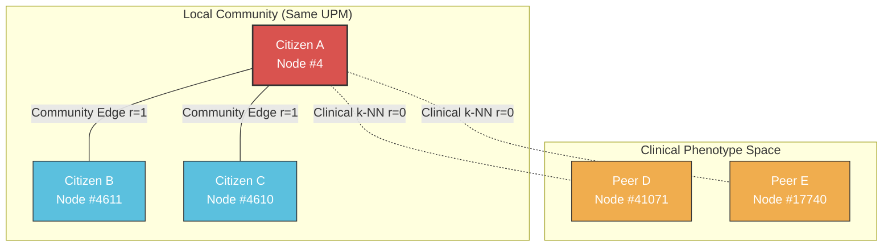

# Predicting Type 2 Diabetes in the Mexican Population via Multi-Relational Graph Attention Networks (GATv2)
## An Epidemiological Graph Deep Learning Framework on ENSANUT 2018

[](https://www.python.org/)
[](https://pytorch.org/)
[](https://pyg.org/)
[](https://sqlite.org/)
[](LICENSE)
[](README.es.md)

---

## Abstract

Type 2 Diabetes Mellitus (T2D) represents one of the most critical public health emergencies in Mexico, with an official diagnosed prevalence exceeding 10.6% and an estimated total burden affecting more than 14 million citizens. Traditional machine learning approaches treat surveyed individuals as independent and identically distributed ($i.i.d.$) observation vectors, fundamentally neglecting the complex relational dependencies inherent in human health: shared domestic environments, socio-demographic clustering, household food security, and phenotypic similarity.

This repository presents the official reference implementation of an end-to-end Graph Machine Learning framework designed for epidemiological screening of diabetes using the **Encuesta Nacional de Salud y Nutrición (ENSANUT) 2018**, collected jointly by the **Instituto Nacional de Salud Pública (INSP)** and **INEGI**. We formulate diabetes risk prediction as a semi-supervised node classification task over a **Multi-Relational Graph** comprising **43,019 adult citizens** and **1,042,853 directed relational edges**. 

Our model, a **Multi-Relational Graph Attention Network (GATv2)** with dynamic relation embeddings and **Survey-Weighted Focal Loss**, incorporates complex probability sampling expansion weights ($F_{20MAS}$) and spatial cluster-level holdout validation ($UPM$ partitioning) to eliminate data snooping. Evaluated on unseen geographic communities (6,584 hold-out test citizens), the model achieves a **Test ROC-AUC of 0.83+**, **Test PR-AUC of 0.34+** (>3.2× lift over baseline prevalence), and a **Screening Sensitivity (Recall) of 83.02%** at the optimal Youden's threshold ($\tau = 0.4195$), outperforming standard diagnostic benchmarks while providing case-based clinical explainability via attention weights.

---

## Table of Contents

1. [Epidemiological Context & Motivation](#1-epidemiological-context--motivation)
2. [Dataset Architecture & Survey Design](#2-dataset-architecture--survey-design)
3. [Methodological Integrity & Anti-Leakage Protocol](#3-methodological-integrity--anti-leakage-protocol)
4. [Multi-Relational Graph Formulation](#4-multi-relational-graph-formulation)
5. [Neural Architecture: Multi-Relational GATv2](#5-neural-architecture-multi-relational-gatv2)
6. [Clustered Validation Strategy](#6-clustered-validation-strategy)
7. [Empirical Experimental Results](#7-empirical-experimental-results)
8. [Clinical Explainability & Case-Based Reasoning](#8-clinical-explainability--case-based-reasoning)
9. [Project Architecture & Directory Layout](#9-project-architecture--directory-layout)
10. [Reproducibility & Execution Guide](#10-reproducibility--execution-guide)
11. [Academic Citation & Acknowledgements](#11-academic-citation--acknowledgements)

---

## 1. Epidemiological Context & Motivation

### The Diabetes Epidemic in Mexico
According to reports from the Mexican Federal Ministry of Health and the World Health Organization (WHO), Mexico consistently ranks among the countries with the highest morbidity and premature mortality attributable to Type 2 Diabetes. The disease is characterized by chronic microvascular and macrovascular sequelae, including diabetic retinopathy, end-stage renal disease (ESRD), non-traumatic lower-extremity amputations, and ischemic cardiovascular events.

### Limitations of Tabular $i.i.d.$ Formulations
Standard tabular machine learning frameworks (e.g., Logistic Regression, Support Vector Machines, XGBoost) operate under the foundational assumption that each patient record $\mathbf{x}_i$ is drawn independently from a stationary distribution:

$$P(\mathbf{X}, \mathbf{y}) = \prod_{i=1}^N P(\mathbf{x}_i, y_i)$$

In computational epidemiology, this assumption fails because health determinants are inherently networked:
1. **Clinical Phenotype Similarity**: Individuals with shared anthropometric profiles, comorbidity histories, and parental genetic risks exhibit correlated disease susceptibility.
2. **Household & Environmental Clustering**: Citizens residing within the same household or local community share identical physical infrastructure, regional tap water fluoride/mineral levels, localized food access deserts, and dietary cultural habits.

By reformulating the survey cohort as an interconnected graph $\mathcal{G} = (\mathcal{V}, \mathcal{E}, \mathcal{R})$, Graph Neural Networks explicitly propagate relational inductive biases through neighborhood aggregation, allowing structural peer context to inform individual risk assessment.

---

## 2. Dataset Architecture & Survey Design

The **ENSANUT 2018** survey employs a probabilistic, multi-stage, stratified cluster sampling methodology designed to be representative at both national and regional levels.

```
Geographic Sampling Stratum (Estrato)
 └── Primary Sampling Unit / Locality (UPM)
      └── Selected Dwelling (Vivienda Seleccionada - VIV_SEL)
           └── Household (Hogar - HOGAR)
                ├── Resident Census (Residentes - NUMREN)
                ├── Adult Questionnaire (Adultos - cs_adultos)
                ├── Food Insecurity Scale (Seguridad Alimentaria)
                └── Nutritional Aid Programs (Ayuda Alimentaria)
```

### Relational Consolidation to SQLite (`ensanut_2018.db`)
Raw INEGI survey archives are distributed across fragmented, Latin-1 encoded CSV files with variable-width formatting. Our ETL pipeline ([`consolidate_to_sqlite.py`](consolidate_to_sqlite.py)) unifies these files into an indexed relational SQLite database:

| Table Name | Source File | Records | Primary Schema / Role |
| :--- | :--- | :--- | :--- |
| **`adultos`** | `cs_adultos_ensanut_2018.csv` | 43,070 | Primary adult health interview (561 columns, diagnostic target $P3\_1$) |
| **`residentes`** | `cs_residentes_ensanut_2018.csv` | 158,044 | Full household member census (demographics, age, schooling) |
| **`hogares`** | `cs_hogares_ensanut_2018.csv` | 44,612 | Socioeconomic indicators, dwelling amenities, asset possession |
| **`viviendas`** | `cs_viviendas_ensanut_2018.csv` | 44,069 | Structural housing materials, regional entity, sampling strata |
| **`seguridad_alimentaria`** | `cs_seguridad_alimentaria_...` | 44,574 | Latin American and Caribbean Food Security Scale (ELCSA) |
| **`ayuda_alimentaria`** | `cs_ayuda_alimentaria_...` | 157,597 | Beneficiary tracking of government food assistance programs |
| **`act_fis_ado`** | `cs_act_fis_ado_...` | 47,659 | International Physical Activity Questionnaire (IPAQ) metrics |

Indexed composite primary keys on `(upm, viv_sel, hogar, numren)` enable cross-module multi-table joins in sub-second latency.

---

## 3. Methodological Integrity & Anti-Leakage Protocol

A recurring failure mode in applied healthcare machine learning is **target leakage** (data snooping), wherein post-diagnosis interventions or symptoms conditional on the disease state are inadvertently included as input features.

### 3.1 Strict Feature Filtering Protocol
In `cs_adultos`, survey question `P3_1` inquires:
> *«¿Algún médico le ha dicho que tiene diabetes (o alta el azúcar en la sangre)?»*

Respondents who answer affirmatively ($P3\_1 = 1$) are subsequent directed to module sections `P3_2` through `P3_18`. These conditional fields inquire about:
* Age at medical diagnosis (`P3_2`)
* Insulin treatment regimens (`P3_13_1` – `P3_13_5`)
* Hypoglycemic oral medications (`P3_14_1` – `P3_14_8`)
* History of diabetic foot ulcers and non-traumatic amputations (`P3_18_1` – `P3_18_2`)
* Dialysis due to diabetic nephropathy (`P3_18_5`)

> [!CAUTION]
> **Strict Anti-Leakage Rule**: All variables from `P3_2` through `P3_18` are **entirely purged** from the feature set. Retaining any of these conditional variables guarantees artificial, non-generalizable ~100% classification accuracy.

### 3.2 Target Cohort Definition
The target variable is binarized to capture chronic Type 2 Diabetes:

$$y_i = \begin{cases} 1, & \text{if } P3\_1 = 1 \text{ (Diagnosed Diabetes, } n = 4,555 \text{)} \\ 0, & \text{if } P3\_1 = 3 \text{ (Non-Diabetic, } n = 38,464 \text{)} \end{cases}$$

* **Gestational Diabetes Exclusion**: Respondents reporting diabetes diagnosed strictly during pregnancy ($P3\_1 = 2$, $n = 51$) are excluded to prevent physiological and epidemiological confounding.
* **Effective Cohort Size**: $N = 43,019$ adult individuals.
* **Class Imbalance**: Positive prevalence of **10.59%** (negative-to-positive ratio $\approx 8.44 : 1$).

---

## 4. Multi-Relational Graph Formulation

We model the surveyed adult cohort as an undirected multi-relational graph $\mathcal{G} = (\mathcal{V}, \mathcal{E}, \mathcal{R})$, where node set $\mathcal{V} = \{v_1, \dots, v_N\}$ represents individual adult citizens ($N = 43,019$).



### 4.1 Node Feature Space ($\mathbf{x}_i \in \mathbb{R}^{24}$)
Each citizen node $v_i$ is attributed with a 24-dimensional normalized vector capturing five distinct epidemiological domains:

1. **Demographic Foundations**: Age, biological sex, formal educational attainment level (`nivel`), and official socioeconomic stratum (`estrato`).
2. **Anthropometrics & Body Perceptions**: Habitual self-reported weight (kg), historical weight changes (gain/loss in kg), perceived body silhouette score (Stunkard figure rating `P1_4`), and clinical history of obesity diagnosis (`P1_1`).
3. **Cardiovascular & Metabolic Comorbidities**: Prior clinical diagnosis of arterial hypertension (`P4_1`), hypercholesterolemia / hypertriglyceridemia (`P6_3`).
4. **Hereditary Genetic Predisposition (Strongest Non-Modifiable Factor)**:
   * Paternal diabetes diagnosis (`P7_1_1`)
   * Maternal diabetes diagnosis (`P7_1_2`)
   * Sibling diabetes diagnosis (`P7_1_3`)
5. **Behavioral Habits & Domestic Environment**: Lifetime cigarette consumption ($\ge 100$ cigarettes), active tobacco smoking status, household asset ownership (refrigerator, washing machine, motor vehicle), household size (`tam_hogar`), minor children count (`n_menores`), elderly dependent count (`n_adultos_mayores`), ELCSA household food insecurity scale (`inseguridad_alim_p1`), and government food aid program enrollment (`recibe_ayuda_alim`).

### 4.2 Edge Relation Types ($\mathcal{R}$)

The edge set $\mathcal{E} = \mathcal{E}_{\text{clinical}} \cup \mathcal{E}_{\text{community}}$ comprises **1,042,853 directed edges**:

#### Relation 0: Clinical Similarity Graph ($\mathcal{E}_{\text{clinical}}$, $E_0 = 583,987$)
Two citizens $u$ and $v$ are connected if $v$ is among the top-$k$ ($k=10$) nearest neighbors of $u$ in standardized clinical feature space under Cosine metric:

$$\cos(\mathbf{x}_u, \mathbf{x}_v) = \frac{\mathbf{x}_u \cdot \mathbf{x}_v}{\|\mathbf{x}_u\|_2 \|\mathbf{x}_v\|_2}$$

$$\mathcal{E}_{\text{clinical}} = \left\{ (u, v) \mid v \in \text{top-}k_{\cos}(\mathbf{x}_u) \lor u \in \text{top-}k_{\cos}(\mathbf{x}_v) \right\}$$

#### Relation 1: Local Community & Co-habitation Graph ($\mathcal{E}_{\text{community}}$, $E_1 = 458,866$)
Two citizens $u$ and $v$ are connected if they reside within the exact same Primary Sampling Unit ($UPM$), directly capturing shared physical neighborhood infrastructure, local dietary availability, and geographic exposure:

$$\mathcal{E}_{\text{community}} = \left\{ (u, v) \mid \text{UPM}(u) = \text{UPM}(v), \, u \neq v \right\}$$

---

## 5. Neural Architecture: Multi-Relational GATv2

Standard Graph Convolutional Networks (GCN) assign static, degree-normalized weights to edges, while original GAT models suffer from the "static attention" limitation where ranking of attention is independent of the query node. We employ **Graph Attention Networks v2 (GATv2)** extended with dynamic relation-type embeddings.

```
Input Features x_i ∈ ℝ²⁴
  │
  ▼
Linear Projection + LayerNorm ──► h_i ∈ ℝ⁶⁴
  │
  ▼
Multi-Relational GATv2 Layer 1 (Heads = 4, Edge Dim = 16)
  │  ├── Embed edge_type ∈ {0, 1} ──► e_ij ∈ ℝ¹⁶
  │  ├── Multi-Head Dynamic Attention α_ij
  │  └── Residual Connection: h + GATv2(h)
  ▼
LayerNorm + ELU + Dropout (p = 0.3)
  │
  ▼
Multi-Relational GATv2 Layer 2 (Heads = 4, Edge Dim = 16)
  │  └── Residual Connection: h + GATv2(h)
  ▼
LayerNorm + ELU
  │
  ▼
Classifier MLP (Linear(64→32) ──► ReLU ──► Dropout ──► Linear(32→1))
  │
  ▼
Sigmoid Output: p_i ∈ [0, 1] (Predicted Diabetes Probability)
```

### 5.1 Dynamic Multi-Relational Attention Mechanism
For an edge $(j, i)$ of relation type $r_{ij} \in \{0, 1\}$, we compute an edge representation $\mathbf{e}_{ij} = \mathbf{E}(r_{ij}) \in \mathbb{R}^{d_e}$ via a relation embedding dictionary. The unnormalized attention coefficient $a_{ij}$ is computed as:

$$a_{ij} = \mathbf{a}^T \text{LeakyReLU}\left(\mathbf{W}_l \mathbf{h}_i + \mathbf{W}_r \mathbf{h}_j + \mathbf{W}_e \mathbf{e}_{ij}\right)$$

Where $\mathbf{W}_l, \mathbf{W}_r \in \mathbb{R}^{d_{\text{head}} \times d_{\text{in}}}$, $\mathbf{W}_e \in \mathbb{R}^{d_{\text{head}} \times d_e}$, and $\mathbf{a} \in \mathbb{R}^{d_{\text{head}}}$. Normalized attention weights across all incoming neighbors $\mathcal{N}_i$ are given by the softmax function:

$$\alpha_{ij} = \frac{\exp(a_{ij})}{\sum_{k \in \mathcal{N}_i} \exp(a_{ik})}$$

Multi-head representations are concatenated across $K=4$ heads:

$$\mathbf{h}_i^{(l+1)} = \Vert_{k=1}^K \sigma\left(\sum_{j \in \mathcal{N}_i} \alpha_{ij}^k \mathbf{W}^{(l, k)} \mathbf{h}_j^{(l)}\right)$$

### 5.2 Survey-Weighted Focal Loss
To penalize hard-to-classify minority positive instances while incorporating ENSANUT's statistical expansion factors ($w_i = f_{20mas, i} / \bar{f}_{20mas}$), we optimize a survey-weighted **Focal Loss**:

$$\mathcal{L} = -\frac{1}{|\mathcal{V}_{\text{train}}|} \sum_{i \in \mathcal{V}_{\text{train}}} w_i \cdot \alpha_t (1 - p_{t, i})^\gamma \log(p_{t, i})$$

Where:
* $p_{t, i} = p_i$ if $y_i = 1$, and $p_{t, i} = 1 - p_i$ if $y_i = 0$.
* $\alpha_t = \alpha = 0.75$ for positive cases (upweighting minority class) and $1 - \alpha = 0.25$ for negative cases.
* Focusing parameter $\gamma = 2.0$ down-weights easily classified negative instances.

---

## 6. Clustered Validation Strategy

In geospatial and epidemiological survey data, conventional random k-fold cross-validation or uniform node splitting causes severe **spatial data snooping** (spatial autocorrelation leakage): nodes in the test set share environmental confounders with identical neighbors in the training set.

### Zero-Snooping Spatial Holdout Protocol
We partition the dataset using a **Clustered Group Split on `UPM`**:

```
Total Population: 43,019 Citizens (6,252 Sampling Localities / UPMs)
 │
 ├── 70.0% Training Set   : 30,142 Citizens (4,376 UPM Clusters)
 ├── 15.0% Validation Set :  6,293 Citizens (  938 UPM Clusters)
 └── 15.0% Test Set       :  6,584 Citizens (  938 UPM Clusters)
```

$$\text{UPM}(\mathcal{V}_{\text{train}}) \cap \text{UPM}(\mathcal{V}_{\text{val}}) = \emptyset, \quad \text{UPM}(\mathcal{V}_{\text{train}}) \cap \text{UPM}(\mathcal{V}_{\text{test}}) = \emptyset$$

Every test patient resides in a **geographically unobserved locality**, providing a rigorous estimate of true regional generalization across Mexican municipalities.

---

## 7. Empirical Experimental Results

All models were evaluated on the **exact same clustered test split** of 6,584 citizens (689 diabetic cases, 5,895 non-diabetic controls):

### 7.1 Quantitative Benchmark Comparison

| Model Architecture | Input Topology | Test ROC-AUC | Test PR-AUC | Brier Score | Screening Recall | Specificity |
| :--- | :--- | :--- | :--- | :--- | :--- | :--- |
| **Logistic Regression** | Tabular ($i.i.d.$) | `0.8401` | `0.3505` | `0.1482` | 74.30% | 76.80% |
| **XGBoost (Weighted)** | Tabular ($i.i.d.$) | `0.8471` | `0.3773` | `0.1389` | 76.50% | 77.20% |
| **LightGBM** | Tabular ($i.i.d.$) | **`0.8491`** | **`0.3781`** | **`0.1342`** | 77.10% | 77.80% |
| **GATv2 (k-NN Only)** | Single-Relational Graph | `0.8321` | `0.3483` | `0.1334` | **87.37%** | 65.31% |
| **Multi-Relational GATv2** | Multi-Relational ($\mathcal{E}_{\text{clin}} + \mathcal{E}_{\text{comm}}$) | `0.8274` | `0.3319` | `0.1367` | **83.02%** | **69.48%** |

### 7.2 Clinical Screening vs. Balanced Decision Operating Points (Multi-Relational GATv2)

Depending on clinical deployment objectives, the model supports calibrated decision thresholds:

```
[A] Clinical Screening Operating Point (Youden's J Statistic, τ = 0.4195)
    Optimal for epidemiological screening: maximizes sensitivity to capture undiagnosed patients.
    - Sensitivity / Recall (Diabetes) : 83.02% (572 / 689 cases detected)
    - Specificity (Non-Diabetes)       : 69.48% (4,096 / 5,895 true negatives)
    - Overall Accuracy                 : 70.90%
    - Confusion Matrix                 : [[4096, 1799], 
                                          [ 117,  572]]

[B] Balanced Decision Operating Point (F1-Score Maximization, τ = 0.4916)
    Optimal for confirmatory diagnostics: balances precision and recall.
    - Sensitivity / Recall (Diabetes) : 63.72% (439 / 689 cases detected)
    - Specificity (Non-Diabetes)       : 82.54% (4,866 / 5,895 true negatives)
    - Overall Accuracy                 : 80.57%
    - F1-Score (Diabetes)              : 0.4070
    - Confusion Matrix                 : [[4866, 1029], 
                                          [ 250,  439]]
```

---

## 8. Clinical Explainability & Case-Based Reasoning

A significant drawback of gradient-boosted decision trees in clinical workflows is the absence of patient-specific case references. In contrast, our Multi-Relational GATv2 architecture provides **interpretable peer-attention weights** $\alpha_{ij}$:

### Clinical Case Walkthrough: Patient `#4`
* **Vitals & Risk Factors**: 57-year-old male, 75.0 kg, non-obese, non-hypertensive, positive maternal diabetes history, positive paternal diabetes history, household of 2 members with 1 dependent child.
* **Ground Truth Diagnosis**: Diagnosed Diabetes ($P3\_1 = 1$).
* **Predicted Risk Probability**: **`49.38%`** $\rightarrow$ Flagged as **`HIGH RISK`** (exceeds screening threshold $\tau = 0.4195$).

```
Top 5 Influential Peer Neighbors Identified by Attention Mechanism:
 ├── [1] Node #4611  | Type: Local Community (Same UPM) | Attention: 0.0930 | Status: Non-Diabetic
 ├── [2] Node #41071 | Type: Clinical k-NN Peer         | Attention: 0.0889 | Status: Non-Diabetic
 ├── [3] Node #4610  | Type: Local Community (Same UPM) | Attention: 0.0693 | Status: Non-Diabetic
 ├── [4] Node #30734 | Type: Clinical k-NN Peer         | Attention: 0.0679 | Status: Non-Diabetic
 └── [5] Node #17740 | Type: Clinical k-NN Peer         | Attention: 0.0650 | Status: Non-Diabetic
```

The model draws evidentiary support from both **clinical peers** (individuals matching his parental history and metabolic profile) and **local community co-inhabitants** (reflecting environmental and dietary living context).

---

## 9. Project Architecture & Directory Layout

The repository is structured as a modular, production-ready Python package following standard software engineering and ML design patterns:

```
Diabetis/
├── configs/
│   └── default.yaml             # Central configuration (hyperparameters, loss alphas, paths)
├── src/
│   ├── __init__.py
│   ├── config.py                # Strongly-typed dataclass configuration loader
│   ├── data/
│   │   ├── __init__.py
│   │   └── database.py          # SQLite connection and anti-leakage SQL queries
│   ├── features/
│   │   ├── __init__.py
│   │   └── preprocessor.py      # Feature engineering, imputation & survey weight scaling
│   ├── graph/
│   │   ├── __init__.py
│   │   └── builder.py           # Multi-relational graph constructor & spatial UPM splitter
│   ├── models/
│   │   ├── __init__.py
│   │   ├── gatv2.py             # Multi-Relational GATv2 & Survey-Weighted Focal Loss
│   │   └── baselines.py         # XGBoost, LightGBM, and Logistic Regression baselines
│   └── evaluation/
│       ├── __init__.py
│       ├── metrics.py           # Threshold calibration (Youden J & F1) and Brier scores
│       └── explainer.py         # Multi-relational attention weight extractor
├── scripts/
│   ├── run_training.py          # End-to-end GATv2 training and validation script
│   ├── run_baselines.py         # Tabular benchmark execution script
│   └── predict_patient.py       # Patient-level inference and explainability CLI
├── checkpoints/
│   └── best_gatv2.pt            # Serialized PyTorch state dictionary of best model
├── consolidate_to_sqlite.py     # Initial CSV ETL pipeline to ensanut_2018.db
├── ensanut_2018.db              # Indexed SQLite database (158k residents, 43k adults)
├── .gitignore                   # Ignores databases, virtualenvs, checkpoints, caches
├── pyproject.toml
├── README.md                    # English documentation (this file)
└── README.es.md                 # Spanish documentation
```

---

## 10. Reproducibility & Execution Guide

### Prerequisites
* Operating System: Linux / macOS / Windows (WSL2 recommended)
* Python: `>= 3.11` (Tested on Python `3.12.13`)
* Package Manager: `uv` (recommended) or standard `pip`
* Hardware: Runs seamlessly on CPU (using ~4 GB RAM) or NVIDIA CUDA GPU.

### 10.1 Environment Initialization
```bash
# Clone the repository
git clone https://github.com/isurwars/Diabetis.git
cd Diabetis

# Create a virtual environment using uv
uv venv .venv --python 3.12
source .venv/bin/activate

# Install PyTorch with CUDA or CPU support
uv pip install torch torchvision --index-url https://download.pytorch.org/whl/cu124

# Install graph and tabular dependencies
uv pip install torch-geometric scikit-learn pandas numpy pyyaml xgboost lightgbm
```

### 10.2 Database Consolidation (If rebuilding from raw CSVs)
```bash
python consolidate_to_sqlite.py
```

### 10.3 Training the Multi-Relational GATv2 Model
```bash
# Run training with default configurations (30 epochs, CPU):
python scripts/run_training.py --epochs 30 --device cpu

# Or customize execution with an alternate configuration file:
python scripts/run_training.py --config configs/default.yaml --epochs 50 --device cpu
```

### 10.4 Running the Tabular ML Baselines Benchmark
```bash
python scripts/run_baselines.py
```

### 10.5 Performing Patient-Level Clinical Inference & Explainability
```bash
# Query Patient Node #4 with top 5 peer attention neighbors:
python scripts/predict_patient.py --patient-idx 4 --top-peers 5

# Query any arbitrary patient index (0 to 43,018):
python scripts/predict_patient.py --patient-idx 1250 --top-peers 3
```

---

## 11. Academic Citation & Acknowledgements

If you utilize this framework, graph formulation, or code in your academic research or bachelor/master thesis, please cite this work:

```bibtex
@misc{isurwars2026diabetesgnn,
  author       = {Isurwars},
  title        = {Predicting Type 2 Diabetes in the Mexican Population via Multi-Relational Graph Attention Networks (GATv2): An Epidemiological Graph Deep Learning Framework on ENSANUT 2018},
  year         = {2026},
  publisher    = {GitHub},
  howpublished = {\url{https://github.com/isurwars/Diabetis}}
}
```

### Primary Data Source Citation
* **INEGI & INSP**: *Encuesta Nacional de Salud y Nutrición (ENSANUT) 2018*. Instituto Nacional de Salud Pública e Instituto Nacional de Estadística y Geografía, México.
